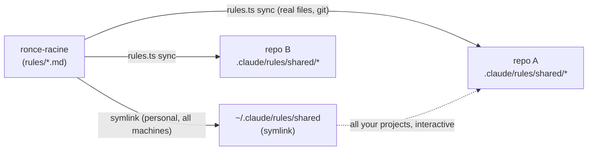

# Ronce Racine

Canonical source of **generic [Claude Code](https://claude.com/claude-code) config** (project-agnostic), installable in any repository. It provides a layer of *always-on* disciplines and *on-demand* workflows that spreads into every project:

- **`rules/`**: *always-on* rules, injected by file type (`paths:`)
- **`skills/`**: *on-demand* workflows, invoked as needed (versioned, validated by a harness)
- **`hooks/`**: reusable Claude Code hooks to wire into `settings.json`
- **`agents/`**: generic subagent definitions to copy into `<repo>/.claude/agents/`
- **`scripts/`**: executable detection scripts (TypeScript via `tsx`, read-only)

An artifact lives here **only if it is truly generic**: no coupling to a project (no specific crate, script, path, or identifier name, no imposed tracker). Project-specific variants stay on the project side (`<repo>/.claude/rules/<project>/`, `<repo>/.claude/skills/`). The doc's examples use fictional project names (`acme-app`, `beta-app`).

> Admission criteria → [`docs/writing-a-rule.md`](docs/writing-a-rule.md) (rules) · [`docs/writing-a-skill.md`](docs/writing-a-skill.md) (skills)
> An agent (LLM) that operates on this repo or installs it elsewhere → [`AGENTS.md`](AGENTS.md)

## Why Ronce Racine, not copy-paste?

Copy-pasted `.claude/` config **rots**: every repo drifts, and nobody remembers which rule came from where. Ronce Racine keeps **one canonical source** installed into many repos, with a **lockfile + anti-drift CI gate** so they never silently diverge, plus a smart installer that proposes only what fits each project's stack. That is what plain copy-paste and hand-rolled per-repo config don't give you: **fleet-wide consistency you can enforce in CI**, while any repo can still `detach` an artifact to customize it.

## Requirements

- **Node ≥ 18** with `tsx` (invoked as `npx tsx …`). Required both for the installer and, in the target repo, for any installed **hooks** (they run via `npx tsx`).
- **rules / skills / agents are plain Markdown** and need no toolchain. Hooks are optional: skip them on a repo where you don't want a Node dependency.

## The name

*Ronce Racine* means "bramble root" in English. A bramble roots deeply and spreads everywhere, unkillable: the exact image of a layer of *always-on* disciplines that takes root in every project and refuses to die, with just enough thorns to remind you it says "discipline". The two words are singular, joined in the style of the ecosystem the project comes from.

> *In English:* **Ronce Racine** is French for "bramble root", a plant that roots deep and spreads everywhere, unkillable. A fitting name for a layer of engineering discipline meant to take hold in every repository.

## Two distribution layers



| Layer | Mechanism | Scope |
|--------|-----------|--------|
| **Global (personal)** | `~/.claude/rules/shared` → symlink to `rules/` | All your machines, all your projects, interactive. Not versioned per project. |
| **Per-repo (team / CI)** | `rules.ts sync <repo>` copies real files into `<repo>/.claude/rules/shared/` | Travels via git → teammates + headless/CI agents |

The two coexist: an adopted repo loads its project copy (which takes precedence) **and** the global layer; identical content → no effect. Detail → [`docs/architecture.md`](docs/architecture.md).

## Available rules (`rules/`)

| File | Scope (`paths`) | Purpose |
|---------|------------------|-------|
| `minimal-code.md` | code (rs/ts/tsx/vue/py/go) | YAGNI + readability > brevity guardrail |
| `commits.md` | always active | commit message format |
| `test-discipline.md` | `*.spec.ts` / `*.test.ts` | test discipline (generic core) |
| `secure-logging.md` | `*.rs` / `*.ts` | GDPR: never log sensitive data |
| `detection-gap-protocol.md` | `docs/postmortems/**` | a P0 found by a user = a detection failure |
| `sql-migrations-discipline.md` | `**/migrations/**` | immutable, idempotent, expand-contract migrations |
| `pre-commit-secret-detection.md` | always active | no secret committed (gitleaks + grep fallback) |
| `subscription-cleanup.md` | front-end code (ts/tsx/js/vue) | explicit teardown of subscriptions/listeners/timers |
| `error-handling-discipline.md` | code (ts/py/go/rs/php/java) | no swallowed error, no panic/unwrap on fallible |
| `clean-architecture-deps.md` | code (ts/py/go/rs/php/java) | dependencies toward the domain, no logic in the handler |
| `no-raw-sql-interpolation.md` | code (ts/py/go/rs/php/java) | parameterized queries, never SQL interpolation |
| `ui-states-complete.md` | components (tsx/jsx/vue/svelte) | loading/error/empty/success all handled and distinguishable |

Each rule also carries `version` + `metadata.last-reviewed` (parity with the skills), validated by `npm test`.

## Available skills (`skills/`)

Generalized (project-agnostic) versions of the heavy workflows. The project variants (coupled to a tracker, a stack, scripts) stay in the relevant repo. Each skill carries a semver `version` + `metadata` in its frontmatter and follows the standard contract (see [`docs/writing-a-skill.md`](docs/writing-a-skill.md)).

**Daily drivers**: the discipline skills you reach for during normal development:

| Family | Skills |
|---------|--------|
| Tests & quality | `writing-robust-tests` · `comprehensive-test-strategy` · `adversarial-feature-challenge` · `validating-features-end-to-end` · `commit-readiness-review` · `detection-sweep` |
| Design & implementation | `domain-modeling-design` · `ddd-backend-implementation` · `api-contract-versioning` · `database-schema-evolution` |
| Frontend | `frontend-spec-call-site-audit` · `frontend-fullstack-implementation` · `refactoring-shared-component-api` · `design-system-component-lifecycle` · `visual-regression-check` |
| Bugs / recurrence | `bug-triage-structured` · `bug-ticket-root-cause` · `recurring-bug-root-cause` |
| Ops & review | `merge-request-review` · `ci-pipeline-orchestration` · `production-incident-diagnostic` |
| Process | `recording-decisions` · `qa-session-intake` · `daily-workflow-optimization` |

**Advanced: industrialization audit (opt-in)**: a heavyweight maturity-assessment suite for periodic reviews, not day-to-day use. Install it only if you run engineering audits:

| Orchestrator | Domain audits |
|---------|--------|
| `audit-industrialisation` (runs the domains + consolidates) → `audit-report` | `audit-architecture` · `audit-ci-cd` · `audit-compliance` · `audit-observability` · `audit-performance-frontend` · `audit-quality` · `audit-security` · `audit-testing` |

> Deliberately excluded: `git-workflow`, `jira-bug` (coupled to a specific project: dedicated branch hierarchy and Jira tracker).

Some skills embed detection `scripts/` (read-only) and `reference/` files loaded on demand (progressive disclosure of the audit grids). Validation: `npm test` (the `skills.ts` harness).

Distribution: the **smart installer** (`install.ts`, see below) copies the relevant skills into `<repo>/.claude/skills/` and watches their drift. Manually: copy the desired folder into `~/.claude/skills/` (global) or `<repo>/.claude/skills/` (per-repo). `install.ts` is the single CLI for all families (rules/skills/hooks/agents); for rules only, use `install.ts install <repo> --rules-only`.

## Available scripts (`scripts/`)

Executable detection scripts (TypeScript, `tsx`, read-only). Referenceable from a skill via `scripts/<file>`.

| File | Scope | Purpose |
|---------|--------|-------|
| `subscription-leak-scan.ts` | frontend (staged git diff) | subscription/listener/timer leaks |

## Quickstart

```bash
# 1. Get Ronce Racine
git clone https://github.com/ChariereFiedler/ronce-racine.git
cd ronce-racine && npm install

# 2. Propose an adapted install for your project (read-only)
npx tsx install.ts plan /path/to/your-repo

# 3. Apply it, then review the diff before committing
npx tsx install.ts install /path/to/your-repo
```

What `plan` looks like on a full-stack repo (real output, read-only, nothing is written):

```console
$ npx tsx install.ts plan ./my-app
Analysis of ./my-app
Signals: git (.git/), ci (CI config), infra (Docker/infra), frontend (frontend
dependencies), backend (Node backend dependencies), tests (E2E deps), code (sources detected)

✓ Recommended (installed by default):
  Rules (9) :
    • minimal-code - YAGNI + readability, any code project
    • commits - commit message format
    • secure-logging - GDPR: never log sensitive data
    • pre-commit-secret-detection - no committed secrets
    • test-discipline - tests detected
    • subscription-cleanup - frontend: subscription teardown
    • clean-architecture-deps - backend: dependency direction
    … 2 more
  Skills (21) :
    • commit-readiness-review - self-review before commit
    • detection-sweep - project detection sweep
    • recurring-bug-root-cause - recurring bug → root cause
    • ci-pipeline-orchestration - CI detected: check/diagnose/retry
    … 17 more
  Scripts (1) :
    • subscription-leak-scan.ts - detects subscriptions/listeners/timers without teardown
  Hooks (3) :
    • skill-reminder.ts - suggests the relevant skills for the prompt
    • bash-npm-silent.ts - silences npm install/ci (less noise)
    • truncate-output.ts - caps verbose output (cargo/git/docker…)
  Agents (2) :
    • code-reviewer - diff review agent
    • qa-tester - E2E testing agent
```

Each artifact is proposed because a signal justified it: a Go repo with no frontend gets
neither `subscription-cleanup` nor the frontend skills. Try it on throwaway repos with
[`playground/setup.ts`](playground/README.md).

The installer runs code on your machine and wires hooks into your `settings.json`. Read [`SECURITY.md`](SECURITY.md) first to know exactly what runs and when.

## Adopting in a repo

### Smart installer (recommended)

`install.ts` scans the target project (stack, tests, SQL, migrations, CI, infra, git) and **proposes** the relevant rules/skills/hooks/agents, then installs on confirmation. Full procedure → [`docs/adopting-a-repo.md`](docs/adopting-a-repo.md).

```bash
npx tsx /path/to/ronce-racine/install.ts plan    <repo>          # proposes (read-only)
npx tsx /path/to/ronce-racine/install.ts install <repo> [--all]  # applies (--all = + optionals)
```

Copies rules (+ the `.adopted` manifest), skills, hooks and agents into `<repo>/.claude/`, and **merges the hook wirings into `<repo>/.claude/settings.json`** (deep-merge by event/matcher, idempotent, backs up an existing file to `settings.json.bak`, preserves unrelated settings). Check the diff, then commit.

### Rules only

```bash
npx tsx /path/to/ronce-racine/install.ts install <repo> --rules-only   # rules + lockfile only
```

Then wire the anti-drift CI gate → [`templates/anti-drift.gitlab-ci.yml`](templates/anti-drift.gitlab-ci.yml). *(The legacy `rules.ts sync/check` CLI still works but is deprecated in favor of `--rules-only`.)*

## Global setup (once per machine)

```bash
# Symlink the canonical rules folder as your global shared layer.
# Remove any individual rule file previously copied to ~/.claude/rules/ that
# would otherwise duplicate the symlinked set (e.g. an old minimal-code.md).
ln -s /path/to/ronce-racine/rules ~/.claude/rules/shared
```

## CLI

```bash
npx tsx install.ts plan    <repo>              # proposes an install adapted to the repo's stack
npx tsx install.ts install <repo> [--all]     # installs rules+skills+hooks+agents (--all = + optionals)
npx tsx install.ts install <repo> --rules-only# installs only the rules
npx tsx install.ts check   <repo> [--strict]  # drift vs canonical (soft, or blocking)
npx tsx install.ts detach  <repo> <token>     # excludes a customized artifact from control
npm test                        # validates artifacts (structure + routing + versioning) AND runs behavioral tests
npm run skills:list             # lists the version + category of each skill
npm run rules:validate          # validates the versioning of the rules
```

## Hooks (`hooks/`)

Generic Claude Code hooks (detail → [`hooks/README.md`](hooks/README.md)). The installer offers them à la carte and **merges the selected ones into `<repo>/.claude/settings.json`** for you (idempotent, with a backup).

| Hook | Event | Role |
|------|-----------|------|
| `skill-reminder.ts` | `UserPromptSubmit` | Suggests the relevant skills based on the prompt (self-maintained, silent when there is no match) |
| `bash-npm-silent.ts` | `PreToolUse / Bash` | Appends `--silent` to setup `npm install` / `npm ci` to reduce context noise |
| `truncate-output.ts` (+ helper `truncate-bash-output.ts`) | `PreToolUse / Bash` | Truncates verbose output beyond a threshold; always preserves the output on error |
| `session-writer` + `session-inject` + `session-precompact` | `Stop` / `SessionStart(compact)` / `PreCompact` | Session-memo trio: persists the context at session end, re-injects it after compaction |
| `worktree-env-setup.ts` | `SessionStart` | Symlinks the main repo's `.env` into the current worktree (idempotent, fail-open) |

All scripts/hooks are TypeScript (run via `tsx`), no `.sh`. These hooks run **automatically** on Claude Code lifecycle events once wired. See [`SECURITY.md`](SECURITY.md) for exactly what each one does and the two to scrutinize (`worktree-env-setup.ts` symlinks your `.env`; the session-memo hooks write to disk).

## Agents (`agents/`)

Generic subagent definitions (project-agnostic), to copy into `<repo>/.claude/agents/`:

- `code-reviewer`: architecture/reliability/correctness review of a diff, read-only, actionable verdict.
- `qa-tester`: running/writing E2E tests (stable locators, zero hard waits).

A project agent (coupled to the stack, the credentials, the tracker) takes precedence over its generic version.
