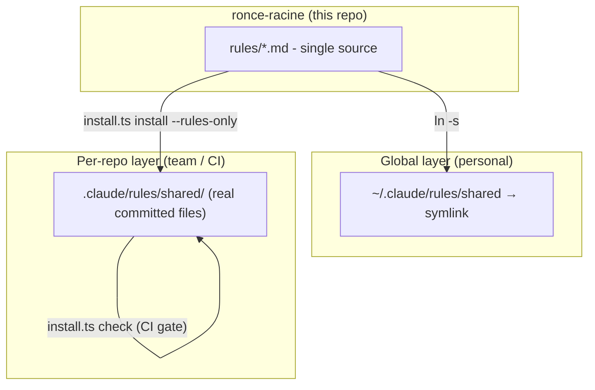

# Architecture

## The problem

Claude Code injects rules by file type via `.claude/rules/` (`paths:` frontmatter). For a long time each project kept its own copy of the "generic" rules in `rules/shared/`. Observed result: **the copies drift**. Across two projects, `commits.md` was identical but `secure-logging.md`, `test-discipline.md` and `detection-gap-protocol.md` had diverged (sections added on one side, not the other).

A generic rule should have **a single source of truth**.

## The solution: two layers

### Global layer (personal) - `~/.claude/rules/`

`~/.claude/rules/` is a **user-level** rules directory natively supported by Claude Code: it applies to **all projects** on the machine. In it we place a `shared → ronce-racine/rules` symlink.

- Advantage: zero copies, zero drift, written once, valid everywhere (and on all my machines via `git pull`).
- Limitation: machine-local and **not versioned per project** → invisible to a teammate or a CI runner that just clones the project repo.
- Priority: user-level rules are loaded **before** project rules, so a project rule with the same name still takes precedence.

### Per-repo layer (team / CI) - `.claude/rules/shared/`

For teammates and **headless/CI agents** to see the rules, you need **real committed files** in the repo. A symlink pointing outside the repo (`~/lab/...`) does not travel via git: it would point nowhere after a clone.

`install.ts install --rules-only` copies the **adopted** rules (declared in `.adopted`) from the canonical source into `.claude/rules/shared/`. `install.ts check` is the anti-drift gate (exit 1 on `--strict` if an adopted rule has diverged).

## The `.adopted` manifest

A repo does not necessarily adopt every rule, and may want to **keep an enriched version** of a rule (e.g. `secure-logging` with its project identifiers and its CI lint). The `.claude/rules/shared/.adopted` file (written by `install.ts` for rules) explicitly lists the rules managed by the canonical source (one per line). Rules **not listed are left intact** by install/check.

Splitting rule: the **generic** part of a rule lives here (the *principle*); the **tooled/named** part (script paths, crate names, ast-grep gates) stays in a project rule `rules/<project>/`.

## Coexistence of the two layers

In an adopted repo, the rule exists twice in context (global + project), with identical content → the project version wins, no effect. The slight context duplication is accepted: it guarantees that **non-adopted** repos still benefit from the global layer.

## Beyond rules: skills, hooks, agents

The same drift problem applies to **skills** (on-demand workflows), **hooks** (settings.json scripts) and **agents** (subagents). `install.ts` is the single CLI and covers all **4 families** (rules included, via `--rules-only` when you want rules and nothing else).

- **`plan`** scans the target repo (frontend/backend/tests/sql/migrations/ci/infra/git) and only proposes the relevant artifacts - since the metadata of installed skills loads in every session, we don't install everything.
- **`install`** copies to the right place (`rules/shared/` + `.adopted`, `skills/<name>/`, `hooks/`, `agents/`) and writes the **lockfile** `.claude/.ronce-racine.json`: `{ source: <canonical SHA>, installed: [tokens], detached: [] }`.
- **`check`** compares each managed artifact to the canonical version (byte-for-byte; recursive for skills) → **drift**; and compares the SHA → **staleness**. Soft by default (warns), `--strict` to block.
- **`detach`** takes a deliberately customized artifact out of control (≈ the role of `.adopted` for rules, but per item).

### Versioning & validation

Skills and rules carry `version` (semver) + `metadata.last-reviewed` in their frontmatter. The `tools/skills.ts` harness (`npm test`) validates three axes: **structure** of the skills (frontmatter, sections, links), **routing discriminability** (each trigger classifies its skill at the top), **versioning of the rules**. Detailed contract: [writing-a-skill.md](writing-a-skill.md) · [writing-a-rule.md](writing-a-rule.md).
