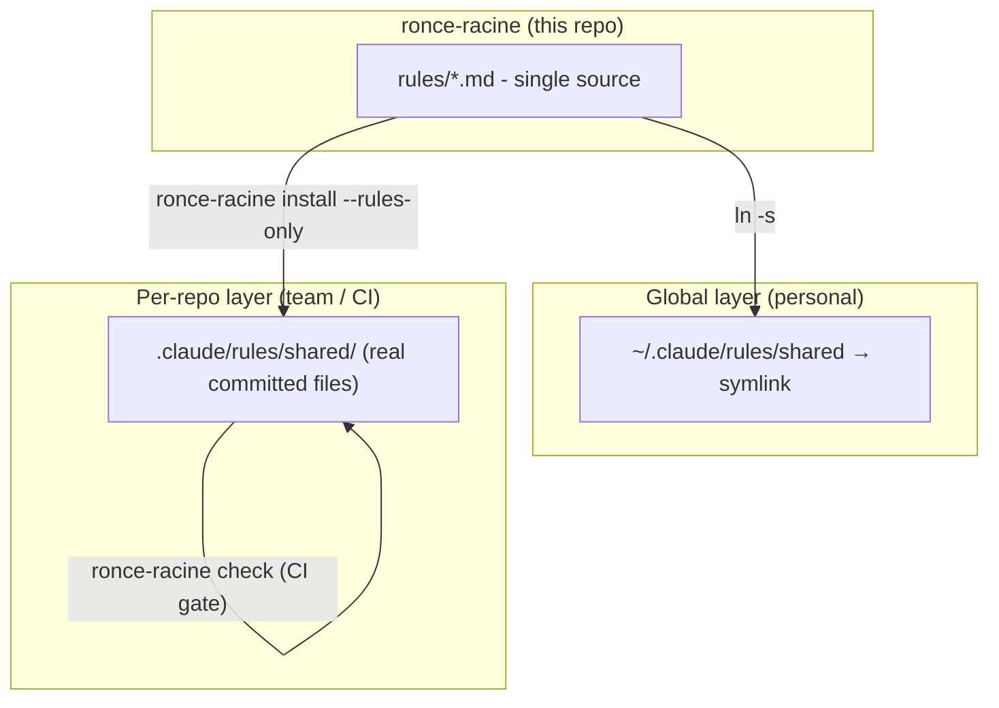
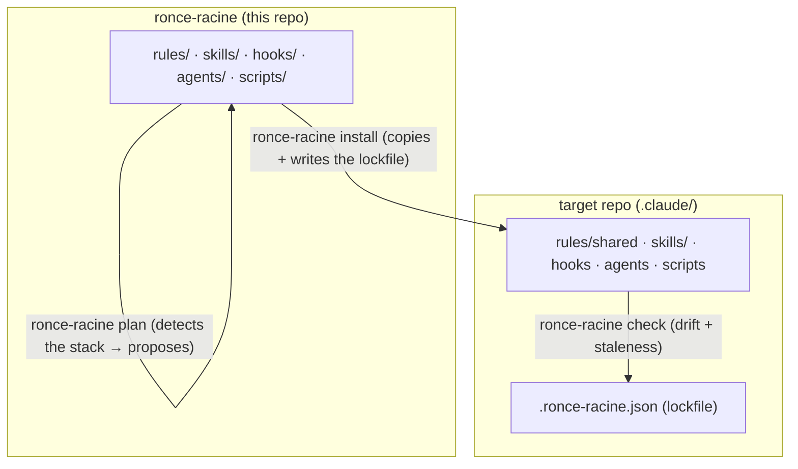

# Architecture

## The problem

Claude Code injects rules by file type via `.claude/rules/` (`paths:` frontmatter). For a long time each project kept its own copy of the "generic" rules in `rules/shared/`. Observed result: **the copies drift**. Across two projects, `commits.md` was identical but `secure-logging.md`, `test-discipline.md` and `detection-gap-protocol.md` had diverged (sections added on one side, not the other).

A generic rule should have **a single source of truth**.

## The solution: two layers

### Global layer (personal) - `~/.claude/rules/`

`~/.claude/rules/` is a **user-level** rules directory natively supported by Claude Code: it applies to **all projects** on the machine. In it we place a `shared → ronce-racine/rules` symlink.

- Advantage: zero copies, zero drift, written once, valid everywhere (and on all my machines via `git pull`).
- Limitation: machine-local and **not versioned per project** → invisible to a teammate or a CI runner that just clones the project repo.
- Priority: user-level rules are loaded **before** project rules, so a project rule with the same name still takes precedence.

### Per-repo layer (team / CI) - `.claude/rules/shared/`

For teammates and **headless/CI agents** to see the rules, you need **real committed files** in the repo. A symlink pointing outside the repo (`~/lab/...`) does not travel via git: it would point nowhere after a clone.

`ronce-racine install --rules-only` copies the **adopted** rules (declared in `.adopted`) from the canonical source into `.claude/rules/shared/`. `ronce-racine check` is the anti-drift gate (exit 1 on `--strict` if an adopted rule has diverged).

## The `.adopted` manifest

A repo does not necessarily adopt every rule, and may want to **keep an enriched version** of a rule (e.g. `secure-logging` with its project identifiers and its CI lint). The `.claude/rules/shared/.adopted` file is **written by `ronce-racine`** at install time and lists, one per line, the rules it just adopted. It is a readable record, not an input: what install and check actually manage is the token list in the lockfile. A rule the installer never wrote is left intact by both; a rule you customized after adopting it is what `detach` is for.

Splitting rule: the **generic** part of a rule lives here (the *principle*); the **tooled/named** part (script paths, crate names, ast-grep gates) stays in a project rule `rules/<project>/`.

## Coexistence of the two layers

In an adopted repo, the rule exists twice in context (global + project), with identical content → the project version wins, no effect. The slight context duplication is accepted: it guarantees that **non-adopted** repos still benefit from the global layer.

## Beyond rules: skills, hooks, agents, scripts

The same drift problem applies to **skills** (on-demand workflows), **hooks** (settings.json scripts), **agents** (subagents) and **scripts** (standalone detectors). `ronce-racine` is the single CLI and covers all **five families** (rules included, via `--rules-only` when you want rules and nothing else).

`plan` scans the target repo (frontend/backend/tests/sql/migrations/ci/infra/git) and only proposes the relevant artifacts, because the metadata of every installed skill loads in every session: installing everything would tax each one. `install` then copies the selection and records it in the lockfile `.claude/.ronce-racine.json` (`{ source: { package, version, contentHash }, installed: [tokens], detached: [] }`), which is what `check` and `detach` operate on.

The mechanics of the four commands, the settings.json merge and the drift states live in one place: [distribution-model.md](distribution-model.md).

### Versioning & validation

Skills, rules and hooks carry a semver `version` plus a `last-reviewed` date (frontmatter for skills and rules, a header comment for hooks). The `tools/skills.ts` harness, wired into `npm test`, runs one subcommand per contract: `validate` (skill frontmatter, sections, links), `triggers` and `routing` (a description must route its own skill above its neighbours), `rules`, `scripts`, `hooks`, `agents`, `templates` and `docs` (documented claims against the installer). Detailed contract: [writing-a-skill.md](writing-a-skill.md) · [writing-a-rule.md](writing-a-rule.md).
