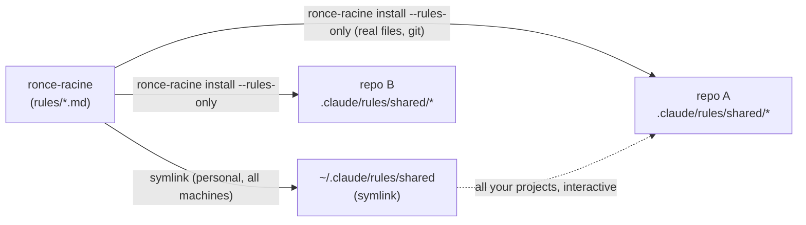

# Distribution model

How the canonical source in this repository reaches the repositories that use
it, and how it is kept from drifting. For the conceptual view of the layers, see
[`architecture.md`](architecture.md); for the step-by-step adoption procedure,
see [`adopting-a-repo.md`](adopting-a-repo.md).

## Two layers, on purpose



| Layer | Mechanism | Scope |
|---|---|---|
| Global (personal) | `~/.claude/rules/shared` symlinked to `rules/` | All your machines, all your projects, interactive sessions. Not versioned per project. |
| Per repo (team and CI) | `ronce-racine install <repo>` copies real files into `<repo>/.claude/` | Travels via git, so teammates and headless or CI agents read the same thing you do. |

The two coexist. An adopted repository loads its project copy, which takes
precedence, and the global layer as well. Identical content means no visible
effect.

```bash
# Global setup, once per machine. Remove any individual rule file previously
# copied to ~/.claude/rules/ that would duplicate the symlinked set.
ln -s /path/to/ronce-racine/rules ~/.claude/rules/shared
```

## What `install` writes

The installer copies the selected artifacts into `<repo>/.claude/` (`rules/shared/`,
`skills/`, `agents/`, `hooks/`, `scripts/`) and writes the lockfile.

Hooks are authored in TypeScript but ship built: the installer copies `.mjs`
files that run on plain `node`, so a target repository needs Node and nothing
else to run them.

## The `settings.json` merge

Hooks only run once they are wired into `<repo>/.claude/settings.json`. The
installer does that wiring itself (`src/settings.ts`), and the merge is
deliberate rather than a file overwrite:

- **deep merge by event and matcher**, so a wiring is added under the right
  `PreToolUse` / `Bash` entry instead of replacing the array;
- **idempotent**, so re-running `install` adds no duplicate wiring;
- **backs up an existing file** to `settings.json.bak` before touching it;
- **preserves unrelated settings** already present in the file.

Every hook fails open. A hook runs on every session of every repository that
installed it, so an error ends in a silent `exit 0` rather than blocking the
user.

## The lockfile and drift

`install` records, per installed artifact, the exact content it wrote. That
record is the reference the drift check compares against.

```bash
npx ronce-racine check <repo>            # reports drift, exit 0
npx ronce-racine check <repo> --strict   # fails, for CI
npx ronce-racine detach <repo> <token>   # exempt an artifact you customized on purpose
```

Three states, and each has an answer:

| State | What it means | What to do |
|---|---|---|
| In sync | the local content matches what was installed | nothing |
| Drifted | the file was edited locally, or the canonical version moved | re-run `install`, or `detach` if the edit was intentional |
| Detached | the repository owns this artifact now | nothing; the gate skips it and says so |

`detach` exists so that a deliberate local customization does not have to lie
to the gate. Without it the only way to silence a false alarm is to disable the
check, which is how drift control dies.

## Removing an installation

```bash
npx ronce-racine uninstall <repo> --dry-run   # list what would go, write nothing
npx ronce-racine uninstall <repo>
```

The same lockfile drives the removal, which is what keeps it from overreaching:
a target's `.claude/` also holds hooks, settings and artifacts the repository
owns, and only the recorded tokens are touched.

| What it finds | What it does |
|---|---|
| An installed artifact | deletes it |
| An artifact carrying local edits | keeps it as `*.pre-uninstall.bak` rather than dropping the edits |
| A detached artifact | leaves it: the repository owns that one now |
| A `*.pre-install.bak` | restores it over the file the install had overwritten |
| Its own hook wirings in `settings.json` | removes those commands, matched by the hook file names in the lockfile |
| Anything else in `settings.json` | leaves it, including a hook you wired yourself |
| A directory left empty | removes it, up to `.claude/` itself |

The lockfile is deleted once every artifact is gone, just before the empty
directories are swept: it lives in `.claude/` itself, so keeping it any longer
would preserve the directory the sweep exists to remove. Everything destructive
has already happened by then, so an interruption leaves nothing worse than an
empty directory.

Wire [`templates/anti-drift.gitlab-ci.yml`](../templates/anti-drift.gitlab-ci.yml)
into the target repository's pipeline and `check --strict` turns the convention
into a gate.

## The plugin layer

```bash
/plugin marketplace add ChariereFiedler/ronce-racine
/plugin install ronce-racine@ronce-racine
```

The plugin distributes the skills and the agents, subscribed rather than copied:
they update when the plugin updates, and nothing lands in the repository.

Deliberately absent from the plugin: the rules, the hooks and the drift control.
Rules are always-on context and hooks execute code on your machine. Both are
things a team should see in a reviewed diff rather than inherit from a
subscription. Pick the plugin to try the skills on your own machine; pick the
CLI when a team and a CI depend on the result.
